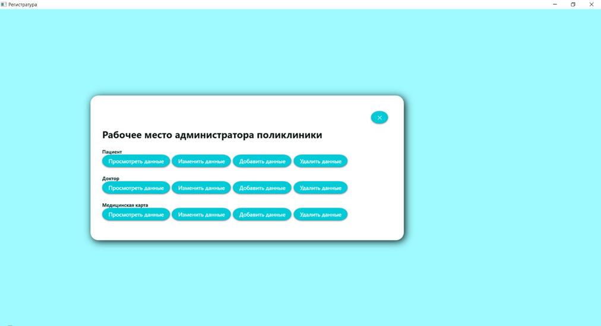
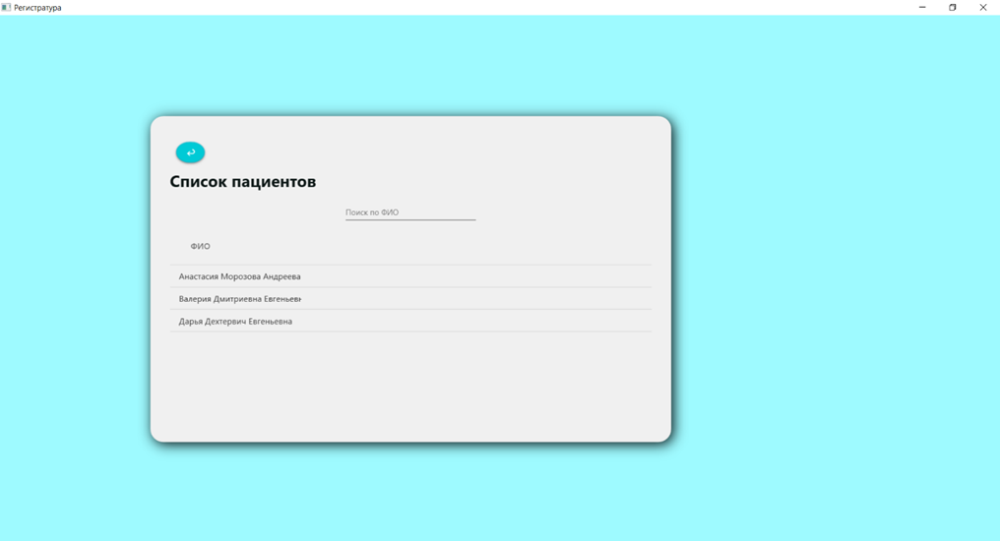
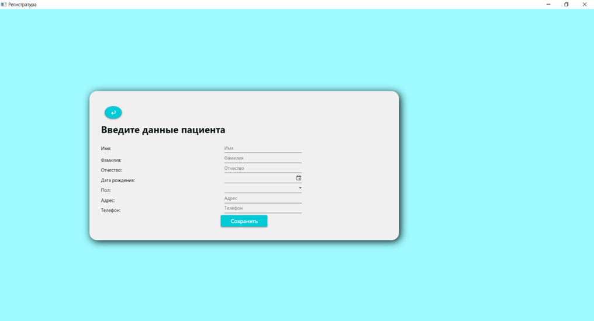

# Рабочее место администратора поликлиники


Десктопное приложение для управления пациентами, врачами и медицинскими картами в поликлинике. Разработано на WPF и C# с современным и удобным интерфейсом.

Английская версия доступна [здесь](README.md).

## Описание
Приложение позволяет администратору поликлиники просматривать, добавлять, редактировать, удалять и искать информацию о пациентах, врачах и медицинских картах. Данные хранятся в XML-файле, что делает систему легковесной и простой в развёртывании.

## Используемые технологии
- **C#** – основной язык программирования
- **WPF (Windows Presentation Foundation)** – для графического интерфейса
- **Material Design In XAML Toolkit** – для современного стиля
- **.NET 6.0** – платформа приложения
- **XML-сериализация** – для хранения данных

## Возможности
- **Управление пациентами**: добавление, редактирование, удаление, поиск по ФИО.
- **Управление врачами**: аналогичные операции с дополнительными полями (специализация, кабинет).
- **Медицинские карты**: создание и редактирование карт, привязанных к пациентам, с указанием дат лечения и анамнеза.
- **Сохранение данных**: автоматическая загрузка и сохранение в XML-файл (`hospital.xml`).
- **Современный интерфейс**: стилизация с помощью Material Design.

## Скриншоты

*Главное окно*


*Список пациентов*


*Окно добавления пациента*


## Пример структуры данных

```
xml
<Hospital>
  <Peoples>
    <Person Id="...">
      <Surname>Иванов</Surname>
      <Name>Иван</Name>
      <Patronymic>Иванович</Patronymic>
      <DateBirthday>1980-05-15</DateBirthday>
      <Gender>Мужской</Gender>
      <Address>ул. Ленина, д. 1</Address>
      <Number>+375291234567</Number>
    </Person>
  </Peoples>
  <Doctors>...</Doctors>
  <MedCards>...</MedCards>
</Hospital>

```

### Установка и запуск
1. Требования
- ОС Windows с установленным .NET 6.0 SDK или runtime
- Visual Studio 2022 (для сборки из исходников)

2. Шаги
1) Клонируйте репозиторий:
   
  `git clone https://github.com/ddeeduck/Polyclinic-Administrator-Workstation.git`

2) Откройте файл решения (PolyclinicApp.sln) в Visual Studio 2022.

3) Восстановите NuGet-пакеты (обычно происходит автоматически).

4) Соберите решение (Сборка > Собрать решение).

5) Запустите приложение (F5).

### Использование
- При первом запуске автоматически создастся пустой файл hospital.xml.
- Используйте кнопки главного меню для перехода к пациентам, врачам или медкартам.
- Кнопки "Просмотр", "Добавить", "Изменить", "Удалить" позволяют выполнять соответствующие операции.
- Поле поиска фильтрует списки по ФИО.

### Ограничения
- Нет аутентификации (однопользовательский режим).
- Данные хранятся локально в XML, не подходит для одновременного доступа нескольких пользователей.
- Базовая валидация (проверка на пустые поля и корректность дат).

### Автор
Дарья – [GitHub](https://github.com/ddeeduck), [Telegram](https://t.me/deeduck), [LinkedIn](www.linkedin.com/in/deeduck), Email: dehterevich.daria@gmail.com

### Лицензия
Проект распространяется под лицензией MIT – подробности в файле LICENSE.
